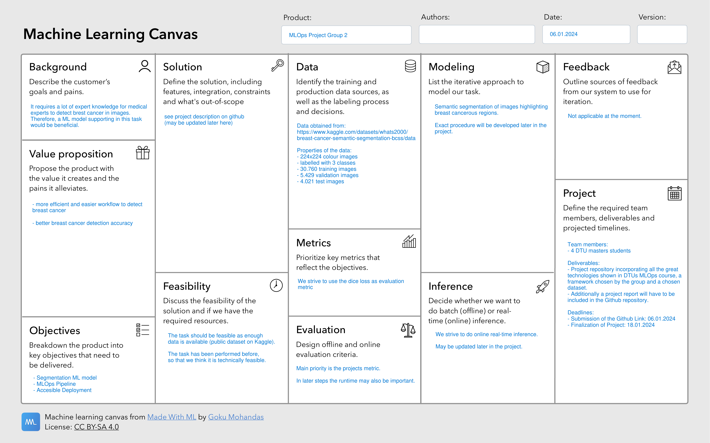

# Breast Cancer Image Segmentation

## Software Requirements

- python >= 3.10
- pip >=
- docker
- gcp command line interface
- conda >=
- 

## Overview (PROPOSAL)

We perform segmentation of medical images to highlight presence of breast cancer.

This project is a part of a course in machine learning operations in the danish technical university. We will be working
on a segmentation of medical images to highlight presence of breast cancer. To accomplish this we use the 
[Breast cancer semantic segmentation dataset](https://www.kaggle.com/datasets/whats2000/breast-cancer-semantic-segmentation-bcss/data) 
provided on kaggle. The framework used to train the model is [MONAI](https://monai.io/) with the intent of a UNET architecture which 
is popular for image segmentation



### Data

Our data used is the [Breast cancer semantic segmentation dataset](https://www.kaggle.com/datasets/whats2000/breast-cancer-semantic-segmentation-bcss/data) 
specifically the **224x224** image sizes. 

[APPLY IMAGE EXAMPLE]

[APPLY DATASET DESCRIPTION]

#### Data version control (DVC)

For remote data version control we use a GCP blob as a data lake since we work with image data we need a file storage instead 
of a traditional table storage.

### Modeling

The framework used to train the model is [MONAI](https://monai.io/), a PyTorch based framework for medical image analysis, that adds a level of abstraction to PyTorch. Instead of defining each layer of our own models, we can instead use entire networks (that are based on scientific paper from the medical research community) and only need to specifiy hyperparameters such as channel sizes, dimensions and loss functions. One such architecure family is [UNet](https://www.nature.com/articles/s41592-018-0261-2). We inten to use a UNET architecture as it 
is popular for image segmentation. We plan to use a [BasicUNet](https://docs.monai.io/en/stable/networks.html#basicunet) implementation first (based on CNN modules), and later potentially compare the performance to vision transformer based UNET like [UNetr](https://docs.monai.io/en/stable/networks.html#unetr) (this however is intended for 3D image data, so yet to be calrified).

### Containerization

The training procedure is containerized with docker utilizing the CUDA specific docker container for the option of GPU 
accelerated training.

## Project structure

The project structure was initially created using the [cookiecutter template](https://github.com/cookiecutter/cookiecutter) for the course machine learning operations
 course using the template [mlops_template](https://github.com/SkafteNicki/mlops_template).

The directory structure of the project looks like this:

```txt

├── Makefile             <- Makefile with convenience commands like `make data` or `make train`
├── README.md            <- The top-level README for developers using this project.
├── data
│   ├── processed        <- The final, canonical data sets for modeling.
│   └── raw              <- The original, immutable data dump.
│
├── docs                 <- Documentation folder
│   │
│   ├── index.md         <- Homepage for your documentation
│   │
│   ├── mkdocs.yml       <- Configuration file for mkdocs
│   │
│   └── source/          <- Source directory for documentation files
│
├── models               <- Trained and serialized models, model predictions, or model summaries
│
├── notebooks            <- Jupyter notebooks.
│
├── pyproject.toml       <- Project configuration file
│
├── reports              <- Generated analysis as HTML, PDF, LaTeX, etc.
│   └── figures          <- Generated graphics and figures to be used in reporting
│
├── requirements.txt     <- The requirements file for reproducing the analysis environment
|
├── requirements_dev.txt <- The requirements file for reproducing the analysis environment
│
├── tests                <- Test files
│
├── project_name  <- Source code for use in this project.
│   │
│   ├── __init__.py      <- Makes folder a Python module
│   │
│   ├── data             <- Scripts to download or generate data
│   │   ├── __init__.py
│   │   └── make_dataset.py
│   │
│   ├── models           <- model implementations, training script and prediction script
│   │   ├── __init__.py
│   │   ├── model.py
│   │
│   ├── visualization    <- Scripts to create exploratory and results oriented visualizations
│   │   ├── __init__.py
│   │   └── visualize.py
│   ├── train_model.py   <- script for training the model
│   └── predict_model.py <- script for predicting from a model
│
└── LICENSE              <- Open-source license if one is chosen
```

Overall goal of the project
What framework are you going to use and you do you intend to include the framework into your project?
What data are you going to run on (initially, may change)
What models do you expect to use


