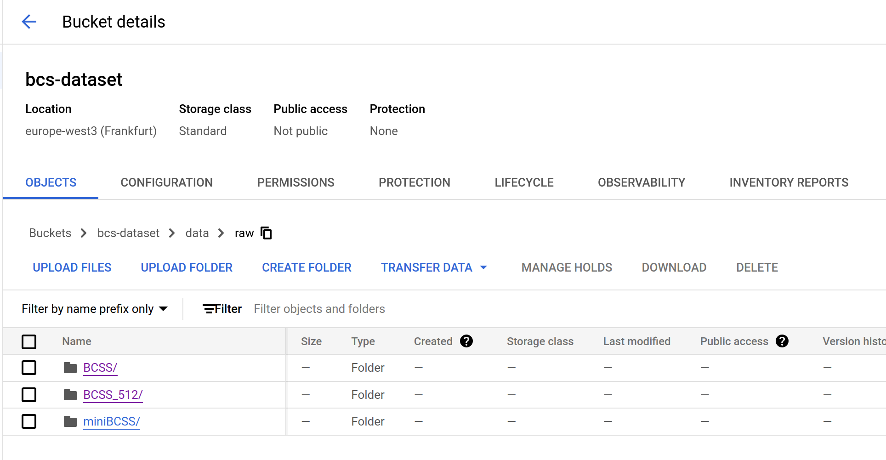

# Exam template for 02476 Machine Learning Operations

This is the report template for the exam. Please only remove the text formatted as with three dashes in front and behind
like:

```--- question 1 fill here ---```

where you instead should add your answers. Any other changes may have unwanted consequences when your report is auto
generated in the end of the course. For questions where you are asked to include images, start by adding the image to
the `figures` subfolder (please only use `.png`, `.jpg` or `.jpeg`) and then add the following code in your answer:

```markdown

```

In addition to this markdown file, we also provide the `report.py` script that provides two utility functions:

Running:

```bash
python report.py html
```

will generate an `.html` page of your report. After deadline for answering this template, we will autoscrape
everything in this `reports` folder and then use this utility to generate an `.html` page that will be your serve
as your final handin.

Running

```bash
python report.py check
```

will check your answers in this template against the constrains listed for each question e.g. is your answer too
short, too long, have you included an image when asked to.

For both functions to work it is important that you do not rename anything. The script have two dependencies that can
be installed with `pip install click markdown`.

## Overall project checklist

The checklist is *exhaustic* which means that it includes everything that you could possible do on the project in
relation the curricilum in this course. Therefore, we do not expect at all that you have checked of all boxes at the
end of the project.

### Week 1

* [ ] Create a git repository
* [ ] Make sure that all team members have write access to the github repository
* [ ] Create a dedicated environment for you project to keep track of your packages
* [ ] Create the initial file structure using cookiecutter
* [ ] Fill out the `make_dataset.py` file such that it downloads whatever data you need and
* [ ] Add a model file and a training script and get that running
* [ ] Remember to fill out the `requirements.txt` file with whatever dependencies that you are using
* [ ] Remember to comply with good coding practices (`pep8`) while doing the project
* [ ] Do a bit of code typing and remember to document essential parts of your code
* [ ] Setup version control for your data or part of your data
* [ ] Construct one or multiple docker files for your code
* [ ] Build the docker files locally and make sure they work as intended
* [ ] Write one or multiple configurations files for your experiments
* [ ] Used Hydra to load the configurations and manage your hyperparameters
* [ ] When you have something that works somewhat, remember at some point to to some profiling and see if
      you can optimize your code
* [ ] Use Weights & Biases to log training progress and other important metrics/artifacts in your code. Additionally,
      consider running a hyperparameter optimization sweep.
* [ ] Use Pytorch-lightning (if applicable) to reduce the amount of boilerplate in your code

### Week 2

* [ ] Write unit tests related to the data part of your code
* [ ] Write unit tests related to model construction and or model training
* [ ] Calculate the coverage.
* [ ] Get some continuous integration running on the github repository
* [ ] Create a data storage in GCP Bucket for you data and preferable link this with your data version control setup
* [ ] Create a trigger workflow for automatically building your docker images
* [ ] Get your model training in GCP using either the Engine or Vertex AI
* [ ] Create a FastAPI application that can do inference using your model
* [ ] If applicable, consider deploying the model locally using torchserve
* [ ] Deploy your model in GCP using either Functions or Run as the backend

### Week 3

* [ ] Check how robust your model is towards data drifting
* [ ] Setup monitoring for the system telemetry of your deployed model
* [ ] Setup monitoring for the performance of your deployed model
* [ ] If applicable, play around with distributed data loading
* [ ] If applicable, play around with distributed model training
* [ ] Play around with quantization, compilation and pruning for you trained models to increase inference speed

### Additional

* [ ] Revisit your initial project description. Did the project turn out as you wanted?
* [ ] Make sure all group members have a understanding about all parts of the project
* [ ] Uploaded all your code to github

## Group information

### Question 1
> **Enter the group number you signed up on <learn.inside.dtu.dk>**
>
> Answer:

MLOps 2

### Question 2
> **Enter the study number for each member in the group**
>
> Example:
>
> *sXXXXXX, sXXXXXX, sXXXXXX*
>
> Answer:

s230640, s232001, s232004, s233561

### Question 3
> **What framework did you choose to work with and did it help you complete the project?**
>
> Answer length: 100-200 words.
>
> Example:
> *We used the third-party framework ... in our project. We used functionality ... and functionality ... from the*
> *package to do ... and ... in our project*.
>
> Answer:

We decided to use the third-party framework [MONAI](https://monai.io/) which offers special functionalities for medical image analysis. We used MONAIs model architectures like the UNet, AttentionUnet or the FlexibleUNet from [monai.networks.net](https://docs.monai.io/en/stable/networks.html#nets). Furthermore we utilized MONAIs implementation of the [DICE-Loss](https://docs.monai.io/en/stable/losses.html#diceceloss), [Focal-Loss](https://docs.monai.io/en/stable/losses.html#focalloss) and [DICE-Metric](https://docs.monai.io/en/latest/metrics.html#mean-dice) for the model training. Additionally we took advantage of MONAIs [transforms](https://docs.monai.io/en/latest/transforms.html) and [data](https://docs.monai.io/en/stable/data.html) methods to ease the loading and handling of the training and validation data as well as to apply transformations to our data. Lastly, also visualisations like the [blend_images()](https://docs.monai.io/en/latest/visualize.html#module-monai.visualize.utils)-function are used to visualise our training results and the received predictions from the deployed model in the prediction API.

## Coding environment

> In the following section we are interested in learning more about you local development environment.

### Question 4

> **Explain how you managed dependencies in your project? Explain the process a new team member would have to go**
> **through to get an exact copy of your environment.**
>
> Answer length: 100-200 words
>
> Example:
> *We used ... for managing our dependencies. The list of dependencies was auto-generated using ... . To get a*
> *complete copy of our development environment, one would have to run the following commands*
>
> Answer:

We used conda for managing the dependencies of our project. The list of dependencies was generated by using the package pipreqs, which creates or replace a requirements.txt file (see the file [here](https://github.com/MLOps-Group-2/Breast_Cancer_Segmentation/blob/main/requirements.txt)). To get a running copy of our development environment, one would have to follow the steps described in [Getting Started](https://github.com/MLOps-Group-2/Breast_Cancer_Segmentation/blob/main/docs/readmes/getting_started.md) after making sure that the [system requirements](https://github.com/MLOps-Group-2/Breast_Cancer_Segmentation/blob/main/docs/readmes/system_req.md) are satisfied. To ease things up we included the necessary steps in make commands. The two steps encompass creating a virtual environment via `make create_environment` and installing all dependencies via `make dev_requirements`. After this the local development environment should be ready to code.

### Question 5

> **We expect that you initialized your project using the cookiecutter template. Explain the overall structure of your**
> **code. Did you fill out every folder or only a subset?**
>
> Answer length: 100-200 words
>
> Example:
> *From the cookiecutter template we have filled out the ... , ... and ... folder. We have removed the ... folder*
> *because we did not use any ... in our project. We have added an ... folder that contains ... for running our*
> *experiments.*
> Answer:

We initialized our repository with the cookiecutter-template and are actually using all of the provided folders. In [breast_cancer_segmentation](https://github.com/MLOps-Group-2/Breast_Cancer_Segmentation/tree/main/breast_cancer_segmentation) we are storing our source code which is divided into a data, models, predicter and trainer folder with corresponding files. The [data](https://github.com/MLOps-Group-2/Breast_Cancer_Segmentation/tree/main/data), [docs](https://github.com/MLOps-Group-2/Breast_Cancer_Segmentation/tree/main/docs), [models](https://github.com/MLOps-Group-2/Breast_Cancer_Segmentation/tree/main/models), [notebooks](https://github.com/MLOps-Group-2/Breast_Cancer_Segmentation/tree/main/notebooks), [reports](../reports) and [tests](https://github.com/MLOps-Group-2/Breast_Cancer_Segmentation/tree/main/tests) folders are used for their intended use but may seem empty as they may be version controlled by DVC or are included in the gitignore file. Additionally we included a [config](https://github.com/MLOps-Group-2/Breast_Cancer_Segmentation/tree/main/config)-folder to store all our hydra & gcp configurations, a [dockerfiles](https://github.com/MLOps-Group-2/Breast_Cancer_Segmentation/tree/main/dockerfiles)-folder to store all relevant dockerfiles and an outputs-folder to temporarily store all outputs of our experiments created by hydra and W&B.

### Question 6

> **Did you implement any rules for code quality and format? Additionally, explain with your own words why these**
> **concepts matters in larger projects.**
>
> Answer length: 50-100 words.
>
> Answer:

In our pipeline we implemented two checks for code quality and format. Locally we use pre-commit checks utilizing ruff. In Github actions we also check code quality and format with ruff. These concepts are important to ensure that code from multiple developers maintains a similar style to be better understandable.

## Version control

> In the following section we are interested in how version control was used in your project during development to
> corporate and increase the quality of your code.

### Question 7

> **How many tests did you implement and what are they testing in your code?**
>
> Answer length: 50-100 words.
>
> Example:
> *In total we have implemented X tests. Primarily we are testing ... and ... as these the most critical parts of our*
> *application but also ... .*
>
> Answer:

In total we have implemented 10 unittests in our Github Actions workflow which primarly focus on testing the data-loading, the training of the model and the prediction API as those are the most important parts of our application. The passing of the tests is one prerequisite for the code to be merged into production.

### Question 8

> **What is the total code coverage (in percentage) of your code? If you code had an code coverage of 100% (or close**
> **to), would you still trust it to be error free? Explain you reasoning.**
>
> Answer length: 100-200 words.
>
> Example:
> *The total code coverage of code is X%, which includes all our source code. We are far from 100% coverage of our **
> *code and even if we were then...*
>
> Answer:

The total code coverage of our code is 83% which includes all of the repositories source code. Obviously, we are far away from achieving 100%, but even 100% does not mean that the code is error free. The reason is that there still might be edge-cases that are not covered and that the tests might be erroneous or insufficient for their intended use.

### Question 9

> **Did you workflow include using branches and pull requests? If yes, explain how. If not, explain how branches and**
> **pull request can help improve version control.**
>
> Answer length: 100-200 words.
>
> Example:
> *We made use of both branches and PRs in our project. In our group, each member had an branch that they worked on in*
> *addition to the main branch. To merge code we ...*
>
> Answer:

In our project we made use of both branches and pull requests as we set up protection rules for the main branch. Each team member created a new branch or used an existing one if he intended to develop new functionalities, fix bugs or write documentation. Upon completion of the development task a PR was created. This pull request encompassed approval from at least one team member and the succesful passing of the Github Actions pipeline. Additionally all conversations had to be resolved. After this process the code could be merged to main by the author. This process improves the workflow as every developer can work individually on his own codebase while the code in the main-branch is always tested and working.

### Question 10

> **Did you use DVC for managing data in your project? If yes, then how did it improve your project to have version**
> **control of your data. If no, explain a case where it would be beneficial to have version control of your data.**
>
> Answer length: 100-200 words.
>
> Example:
> *We did make use of DVC in the following way: ... . In the end it helped us in ... for controlling ... part of our*
> *pipeline*
>
> Answer:

We created our project with the intention to utilize DVC. The data is stored in a GCP-Bucket which is set up to be used via DVC with version control. However, our dataset was not getting larger during our project making version control not a necesity. If we were in a production setting with changes to our training data the situation would be different. Version control via DVC would be very useful to manage different versions of data to increase reproducibility in the project.

### Question 11

> **Discuss you continues integration setup. What kind of CI are you running (unittesting, linting, etc.)? Do you test**
> **multiple operating systems, python version etc. Do you make use of caching? Feel free to insert a link to one of**
> **your github actions workflow.**
>
> Answer length: 200-300 words.
>
> Example:
> *We have organized our CI into 3 separate files: one for doing ..., one for running ... testing and one for running*
> *... . In particular for our ..., we used ... .An example of a triggered workflow can be seen here: <weblink>*
>
> Answer:

Our project utilizes a CI-pipeline implemented as Github Actions workflow consisting of four steps that are executed once a pull request is created:
1. Unittesting: In an initial step we run 10 unittests in total as well as coverage tests to ensure the code is not erroneous.
2. Codecheck: In the codecheck step we do linting and formatting of the code with ruff to comply with style guidelines.
3. Docker Build Training: We test if our docker build for the model training container is succesful to ensure it will also be working on the cloud.
4. Docker Build API: We test if our docker build for the prediction API container is succesful to ensure it will also be working on the cloud.

All tests are only done for the latest ubuntu realease and Python 3.11. Nevertheless, it would be beneficial to include more operating systems and python versions to our pipeline to make create a more universal usability of the code.

Currently caching is not implemented, but should be added if the project were to be developed further. This would reduce the time the pipeline takes to run massively and in return result in more streamlined processes.

One example run of the CI pipeline may be found [here](https://github.com/MLOps-Group-2/Breast_Cancer_Segmentation/actions/runs/7541712795).


## Running code and tracking experiments

> In the following section we are interested in learning more about the experimental setup for running your code and
> especially the reproducibility of your experiments.

### Question 12

> **How did you configure experiments? Did you make use of config files? Explain with coding examples of how you would**
> **run a experiment.**
>
> Answer length: 50-100 words.
>
> Example:
> *We used a simple argparser, that worked in the following way: python my_script.py --lr 1e-3 --batch_size 25*
>
> Answer:

To configure our experiments we took advantage of Hydra. One can run a training with ``python ./breast_cancer_segmentation/trainer/train_model.py train_hyp=<config_file> model_hyp=<config_file>`` where the training and model hyperparameters may be parsed using special config files that include properties such as batch_size or max_epochs. The structure consists of a main config file including the link to sub-config files such as for the training, the model, the prediction and the testing. There we can switch between local and cloud configurations by switching between the files.

### Question 13

> **Reproducibility of experiments are important. Related to the last question, how did you secure that no information**
> **is lost when running experiments and that your experiments are reproducible?**
>
> Answer length: 100-200 words.
>
> Example:
> *We made use of config files. Whenever an experiment is run the following happens: ... . To reproduce an experiment*
> *one would have to do ...*
>
> Answer:

We made use of config files to make our experiments reproducible. Whenever an experiment runs the corresponding config file will be saved in the outputs folder by hydra. Additionally the configuration will also be logged in the Weights & Biases run. To reproduce an experiment one would have to look at the hyperparameters visible in the specific run on W&B and restart a training by inserting those hyperparameters into the runs configuration files.

### Question 14

> **Upload 1 to 3 screenshots that show the experiments that you have done in W&B (or another experiment tracking**
> **service of your choice). This may include loss graphs, logged images, hyperparameter sweeps etc. You can take**
> **inspiration from [this figure](figures/wandb.png). Explain what metrics you are tracking and why they are**
> **important.**
>
> Answer length: 200-300 words + 1 to 3 screenshots.
>
> Example:
> *As seen in the first image when have tracked ... and ... which both inform us about ... in our experiments.*
> *As seen in the second image we are also tracking ... and ...*
>
> Answer:

In W&B we log the training loss for every step (see image 2) and the validation metric for every epoch (see image 2) to monitor the training progress. The validation metric is based on the DICE-Metric provided by MONAI and indicates the progress of the training. The higher the value, the better the model performs on the validation data. The training loss depends on the loss funcion used in the training. This might either be the DiceCE-Loss or the Focal-Loss offered by MONAI. The values shall increase with training progress. Additionally we also visualize the prediction on five specific images of the validation dataset to be able to intuitively say whether a trained model predicts something useful (see image 1). On top of that GPU and CPU parameters like the the power usage or memory usage are monitored (see image 3) to assess the condition of the training hardware and assess whether training with more data would be possible.


By logging those metrics in Weights & Biases it is possible to compare different experiments and derive information about which model and training configuration will probably lead to good results and may be used later in deployment.

### Question 15

> **Docker is an important tool for creating containerized applications. Explain how you used docker in your**
> **experiments? Include how you would run your docker images and include a link to one of your docker files.**
>
> Answer length: 100-200 words.
>
> Example:
> *For our project we developed several images: one for training, inference and deployment. For example to run the*
> *training docker image: `docker run trainer:latest lr=1e-3 batch_size=64`. Link to docker file: <weblink>*
>
> Answer:

We create several images for our project: one for training, one for deployment and one for data monitoring.

**Training docker**

To run the training on would have to first build the docker from the relative [train_model.dockerfile](https://github.com/MLOps-Group-2/Breast_Cancer_Segmentation/blob/main/dockerfiles/train_model.dockerfile).

Build the training docker
```bash
docker build -f ./dockerfiles/train_model.dockerfile . -t trainer:latest
```

Then running the container with the following command below. Since we used hydra for configuration we can append arguments
to the run for overwriting either any hyperparameter or the location of the data inside the container. The idea of overwriting
data locations is that if we want to run the docker training run on vertex we can use the automatically mounted buckets as volumes
with the path `/gcs/....`, but also if we want to mount a volume with the data needed we can overwrite the locations with arguments as well.

Running the training docker outside vertex:
- --shm-size=12G: allocates 12 GB shared memory to the container
- -e: setting the ENV variable with wandb token to authenticate weight and biases report
- -v: volumes we decide to overwrite f.x. the hydra config files with experiments, the data folder and the model repo folder.
```bash
docker run \
	-it \
	--shm-size=12G \
	-d \
	-e WANDB_API_KEY=<YOUR_WANDB_API_KEY> \
	-v path/to/training_config.yaml:/config/hydra/train_hyp/train_cpu.yaml \
	-v path/to/hyperparameters.yaml:/config/hydra/model_hyp/hyp_cpu.yaml \
	-v path/to/data/folder:/gcs/bcs-dataset/data/raw/BCSS  \
	-v path/to/model:/gcs/model-repository-dtumlops/models \
	trainer:latest \
	"train_hyp=train_cpu" "model_hyp=hyp_cpu"
```

**Prediction docker**

The prediction application serves FastAPI through uvicorn and only needs to know what model to pull from our model repository.

Building:
```bash
docker build -t predicter:latest -f dockerfiles/predict_model.dockerfile .
```

Running predicter:
```bash
docker run \
    --rm \
    --name prediction_api \
    -p 8000:80 \
    -e STORAGE_MODE=gcp \
    -e MODEL_PATH=location/of/model/in/bucket \
    predicter:latest
```

### Question 16

> **When running into bugs while trying to run your experiments, how did you perform debugging? Additionally, did you**
> **try to profile your code or do you think it is already perfect?**
>
> Answer length: 100-200 words.
>
> Example:
> *Debugging method was dependent on group member. Some just used ... and others used ... . We did a single profiling*
> *run of our main code at some point that showed ...*
>
> Answer:

To debug our code we used the debugger available in VSCode by inserting breakpoints into our code. Sometimes we additionally inserted print() statements when we performed our debugging sessions, as this method sometimes seemed to be the faster way to track certain characteristics during runtime.
We do not think that our code is performing perfectly in terms of efficiency. This is why we can perform profiling with pytorch_lightnings simple profiler for the model training. This shows for example that the training_step takes less time than the validation step (see image). However, we did not start to research whether the preformance of the code could be improved by any means.


## Working in the cloud

> In the following section we would like to know more about your experience when developing in the cloud.

### Question 17

> **List all the GCP services that you made use of in your project and shortly explain what each service does?**
>
> Answer length: 50-200 words.
>
> Example:
> *We used the following two services: Engine and Bucket. Engine is used for... and Bucket is used for...*
>
> Answer:

In GCP we used the following services to train our model and deploy our application:
- Vertex AI: Used for training the models using custom jobs.
- Compute Engine: Used for training the models (alternative to Vertex AI).
- Artifact Registry: Used to store our training, inference and monitoring containers.
- Cloud Storage: Used to store our data and our trained models.
- Cloud Build: Used to build the docker containers for training, prediction & monitoring.
- Cloud Run: Used to run our server with the prediction api.

### Question 18

> **The backbone of GCP is the Compute engine. Explained how you made use of this service and what type of VMs**
> **you used?**
>
> Answer length: 100-200 words.
>
> Example:
> *We used the compute engine to run our ... . We used instances with the following hardware: ... and we started the*
> *using a custom container: ...*
>
> Answer:

Initially we decided to not use the Compute Engine and instead try to use Vertex AI as it offers a more streamlined process of running our training docker containers. However, we encountered quota issues when trying to run our training on Vertex AI, making it virtually impossible to run training jobs on Vertex AI. Therfore we also implemented a variant to train on Compute Engine, where we launch a docker container that is stored in the artifact registry on a VM to train our model. The instances we used are e.g. n2-standard-8 as no quota for GPU-VMs was available either.

### Question 19

> **Insert 1-2 images of your GCP bucket, such that we can see what data you have stored in it.**
> **You can take inspiration from [this figure](figures/bucket.png).**
>
> Answer:

Data-Bucket:


Model-Bucket:


### Question 20

> **Upload one image of your GCP container registry, such that we can see the different images that you have stored.**
> **You can take inspiration from [this figure](figures/registry.png).**
>
> Answer:

Artifact Registry:


### Question 21

> **Upload one image of your GCP cloud build history, so we can see the history of the images that have been build in**
> **your project. You can take inspiration from [this figure](figures/build.png).**
>
> Answer:


### Question 22

> **Did you manage to deploy your model, either in locally or cloud? If not, describe why. If yes, describe how and**
> **preferably how you invoke your deployed service?**
>
> Answer length: 100-200 words.
>
> Example:
> *For deployment we wrapped our model into application using ... . We first tried locally serving the model, which*
> *worked. Afterwards we deployed it in the cloud, using ... . To invoke the service an user would call*
> *`curl -X POST -F "file=@file.json"<weburl>`*
>
> Answer:

We managed to deploy our model by developing an application utilizing FastAPI and a compiled model using torchserve. In a first step we served the model locally, where one can send an image to the application and receives the segmentation result in return. Afterwards we also deployed
it on GCP where a user could use the swagger docs to upload an image and get resutls.

The following api endpoints provide access to our cloud deployment:
[Swager docs link](https://bcs-prediction-api-2jrai3q6wa-lz.a.run.app/docs)
[Prediction endpoint](https://bcs-prediction-api-2jrai3q6wa-lz.a.run.app/predict-img/)

curl example
```bash
curl -X 'POST' \
  'https://bcs-prediction-api-2jrai3q6wa-lz.a.run.app/predict-img/' \
  -H 'accept: application/json' \
  -H 'Content-Type: multipart/form-data' \
  -F 'data=<LOCATION_OF_LOCAL_IMAGE>'
```

### Question 23

> **Did you manage to implement monitoring of your deployed model? If yes, explain how it works. If not, explain how**
> **monitoring would help the longevity of your application.**
>
> Answer length: 100-200 words.
>
> Example:
> *We did not manage to implement monitoring. We would like to have monitoring implemented such that over time we could*
> *measure ... and ... that would inform us about this ... behaviour of our application.*
>
> Answer:

We managed to implement some monitoring of our deployed model. On one hand we can monitor our services peroformance via GCPs cloud monitoring functionalities. Additionally we implemented some data monitoring which shows whether we encounter data drifting during deployment of our model. Therfore the predictions done by the prediction API are stored to a GCP Bucket and upon a manual trigger or after a certain time compared to the training data. The checks are done using Evidently AI and encompass the greyscale average per image. As time was short, we were not able to implement any other data monitoring checks.

### Question 24

> **How many credits did you end up using during the project and what service was most expensive?**
>
> Answer length: 25-100 words.
>
> Example:
> *Group member 1 used ..., Group member 2 used ..., in total ... credits was spend during development. The service*
> *costing the most was ... due to ...*
>
> Answer:

The billing in GCP felt kind of intransparent as quotas were presumably disabled based on which billing accunt was connected to the project. In the first days of the project we were able to run a few training jobs on Vertex AI (4 in total) just to test that our pipeline works. When we were about to set up a large-scale training job a few days later, we no longer could do this due to unsurmountable quota restrictions.
In total at the end of thursday we had used 22.25 dollars. The cloud compute engine did have the most shares in spending but following close was the cloud storage since we do store alot of data, models and since images are technically stored in buckets via artifact/container registarty. Unfortunately, to commence large scale training we did not have the required quotas resulting in a significantly lower usage of credits.

## Overall discussion of project

> In the following section we would like you to think about the general structure of your project.

### Question 25

> **Include a figure that describes the overall architecture of your system and what services that you make use of.**
> **You can take inspiration from [this figure](figures/overview.png). Additionally in your own words, explain the**
> **overall steps in figure.**
>
> Answer length: 200-400 words
>
> Example:
>
> *The starting point of the diagram is our local setup, where we integrated ... and ... and ... into our code.*
> *Whenever we commit code and puch to github, it auto triggers ... and ... . From there the diagram shows ...*
>
> Answer:


The starting point of our project is the local setup, where we used a cookiecutter template to initialize our repo structure which is version controlled by Git. In our development environment we develop a pytorch application which also utilizes pytorch lightning and MONAI. VSCodes Debugger and Pytorch Profiler is used to resolve errors and improve performance. Configuration is handled by hydra while dependency management is done with conda. Local training can be done by pulling the data via DVC to the local data storage and monitoring it with W&B. Upon succesful code changes the code has to be pushed to a branch on GitHub via a pre-commit step. To merge it into the main source code approval from team members and the succesful completion of the defined Github Actions steps has to be done. On push to the main branch new docker images are build by Cloud Build and will be stored in the Artifact Registry. Those images may then be deployed by Vertex AI, Compute Engine or Cloud Run. Vertex AI and Compute Engine are doing the training whre the data is received from a GCP Bucket. The trained model will be stored in a dedicated model bucket. The prediction container is running on CLoud Run and will use the model from the model bucket and will offer an API Endpoint. The predictions will be saved in another bucket to monitor potential data drifting.

### Question 26

> **Discuss the overall struggles of the project. Where did you spend most time and what did you do to overcome these**
> **challenges?**
>
> Answer length: 200-400 words.
>
> Example:
> *The biggest challenges in the project was using ... tool to do ... . The reason for this was ...*
>
> Answer:

During our project we encountered many challenges. The biggest one was related to GCP where the quotas for Vertex AI and other services could not be increased. Therefore, the training of some of our models had to be performed locally which significantly slowed down model exploration and development. Additionally we encountered some problems when tackling our machine learning problem. At first the models seemed not to learn anything from the data we provided. After a lot of exploration and testing we figured out that our choosen loss function was not the right one for the data and the distribution of class labels. Weights & Biases and the data monitoring helped a lot in this process. A last issue was that our cloud builds consumed a lot of time and a lot of memory in the cloud, resulting in high cost due to the great memory usage. The memory issue could be resolved by manually removing container builds from time to time. This would be a point that would hav eto be optimised in the future to have a better performing pipeline.

Apart from those struggles the tools employed worked fine and we were able to corabollatively develop our project in an efficient and streamlined manner.

### Question 27

> **State the individual contributions of each team member. This is required information from DTU, because we need to**
> **make sure all members contributed actively to the project**
>
> Answer length: 50-200 words.
>
> Example:
> *Student sXXXXXX was in charge of developing of setting up the initial cookie cutter project and developing of the*
> *docker containers for training our applications.*
> *Student sXXXXXX was in charge of training our models in the cloud and deploying them afterwards.*
> *All members contributed to code by...*
>
> Answer:

s230640 was in charge of setting up the cloud infrastructure and setting up the pipelines to succesfully train and predict in the cloud.

s232001 was in charge of implementing the training script using pytorch and implementing the prediction in a FastAPI application.

s232004 was in charge of implementing the unittests, implementing the training script into pytorch-lightning and setting up the data monitoring.

s233561 was in charge of implementing the configuration via hydra, the logging via W&B, profiling via pytorch-lightning, executing the training on a local machine and documenting the project.
